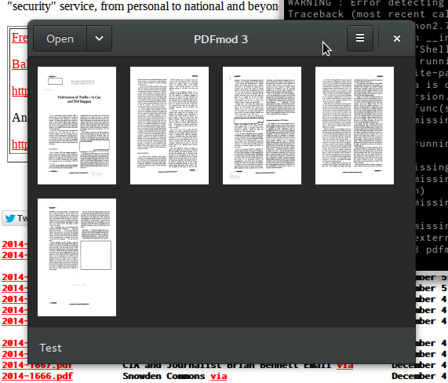

# pdfmod3

PDF document manipulation (crop, rotate and sort) in GTK3 ui. This is just a mockup and it's not usable yet :(

## Dependencies
* python-cairo
* python-pypdf2

## ToDo
* Glade XML ui
* 2D interface for cropping pdfs
